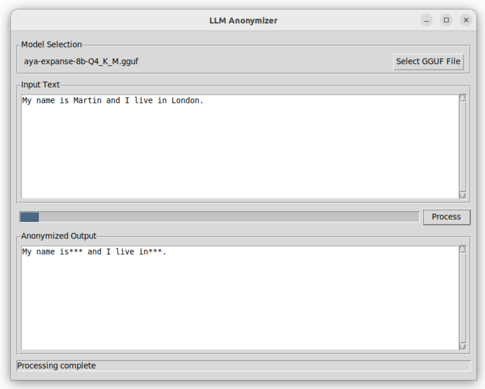

# LLM Anonymizer

A program that runs an advanced Large Language Model (LLM) locally on your computer and uses it to anonymize any text. For example:



## Installation

### Download
Download the executable for Linux from [`/dist/anonymizer_llm`](https://github.com/mrmartin/anonymizer/raw/main/dist/anonymizer_llm)
, or compile the project manually.

### Compilation
If you prefer to compile the project yourself, use the following command:
```bash
pyinstaller --onefile --noconsole --clean --name anonymizer_llm --additional-hooks-dir=./hooks main.py
```

### Running the Program
You can run the program by either:
- Double-clicking the executable
- Running the following command in the terminal:
  ```bash
  ./anonymizer_llm
  ```

## Model Requirement
Upon launching the program, you will be prompted to provide a GGUF file. 

### Recommended Model
For multilingual support, it is recommended to use the **Aya 8B** model. Download it from:
[](https://huggingface.co/bartowski/aya-expanse-8b-GGUF/resolve/main/aya-expanse-8b-Q4_K_M.gguf?download=true)

## Performance
- The program runs at **3 tokens per second** on a standard laptop.
- This equates to approximately **8 characters per second**.

---

Enjoy secure and private anonymization with LLM Anonymizer!
